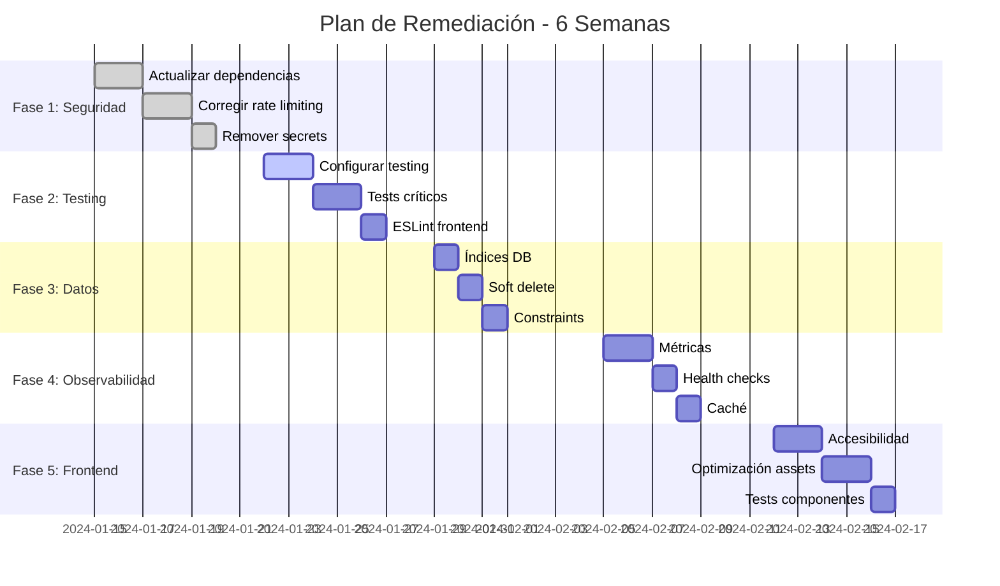

# 11 - Plan de Remediación

## Resumen Ejecutivo

**Duración Total Estimada:** 4-6 semanas
**Esfuerzo Total:** 40-60 horas de desarrollo
**Prioridad:** Alta - Remediación crítica antes de producción

## Fases de Remediación

### 🔥 Fase 1: Seguridad Crítica (Semana 1)
**Duración:** 5 días
**Esfuerzo:** 15-20 horas
**Objetivo:** Eliminar riesgos de seguridad críticos

#### Tareas:
1. **Actualizar dependencias vulnerables** (AUDIT-DEPS-001)
   - Comando: `npm audit fix --force` (revisar manualmente)
   - Verificar compatibilidad
   - Tests de regresión

2. **Corregir rate limiting** (AUDIT-SEC-001)
   - Implementar rate limiting por endpoint
   - Configurar límites apropiados
   - Tests de carga

3. **Remover secrets del repositorio** (AUDIT-SEC-003)
   - Usar variables de entorno
   - Configurar .env.example
   - Actualizar documentación

**Criterios de Éxito:**
- npm audit: 0 vulnerabilidades
- Rate limiting funcional
- No secrets en git history

---

### 🧪 Fase 2: Testing Foundation (Semana 2)
**Duración:** 5 días
**Esfuerzo:** 20-25 horas
**Objetivo:** Establecer base de testing

#### Tareas:
1. **Configurar framework de testing** (AUDIT-TEST-001)
   ```bash
   # Backend
   cd backend
   npm install --save-dev vitest supertest @vitest/coverage

   # Frontend
   cd ../frontend
   npm install --save-dev vitest @testing-library/react jsdom
   ```

2. **Implementar tests críticos** (AUDIT-TEST-003)
   - Tests de autenticación
   - Tests de endpoints principales
   - Tests de validación

3. **Configurar ESLint frontend** (AUDIT-FE-001)
   ```bash
   cd frontend
   npm install --save-dev eslint @typescript-eslint/parser @typescript-eslint/eslint-plugin
   ```

**Criterios de Éxito:**
- Suite de tests ejecutándose
- Cobertura > 50% en código crítico
- ESLint configurado y ejecutándose

---

### 🗄️ Fase 3: Optimización de Datos (Semana 3)
**Duración:** 3 días
**Esfuerzo:** 8-12 horas
**Objetivo:** Mejorar performance de base de datos

#### Tareas:
1. **Añadir índices críticos** (AUDIT-DATA-001)
   ```sql
   CREATE INDEX idx_prospects_user_id ON prospects(user_id);
   CREATE INDEX idx_prospects_status ON prospects(status);
   CREATE INDEX idx_visits_date ON visits(date);
   ```

2. **Implementar soft delete** (AUDIT-DATA-003)
   - Añadir columna `deleted_at`
   - Actualizar queries
   - Modificar modelos

3. **Añadir constraints** (AUDIT-DATA-002)
   - CHECK constraints en campos numéricos
   - Validaciones de formato

**Criterios de Éxito:**
- Consultas críticas < 100ms
- Soft delete implementado
- Constraints funcionando

---

### 📊 Fase 4: Observabilidad (Semana 4)
**Duración:** 4 días
**Esfuerzo:** 12-15 horas
**Objetivo:** Añadir métricas y monitoring

#### Tareas:
1. **Implementar métricas** (AUDIT-PERF-001)
   ```typescript
   npm install prom-client response-time
   // Configurar métricas HTTP
   ```

2. **Mejorar health checks** (AUDIT-PERF-005)
   - Verificar DB connectivity
   - Verificar Redis connectivity
   - Endpoint /health avanzado

3. **Implementar caché básico** (AUDIT-PERF-003)
   ```typescript
   npm install ioredis
   // Caché para estadísticas
   ```

**Criterios de Éxito:**
- Métricas expuestas en /metrics
- Health checks verificando dependencias
- Caché funcionando en dashboard

---

### 🎨 Fase 5: Mejoras Frontend (Semana 5-6)
**Duración:** 5 días
**Esfuerzo:** 15-20 horas
**Objetivo:** Optimizar UX y performance

#### Tareas:
1. **Auditoría de accesibilidad** (AUDIT-FE-002)
   - Revisar contraste de colores
   - Añadir labels apropiados
   - Tests de navegación por teclado

2. **Optimización de assets** (AUDIT-FE-003)
   - Comprimir imágenes
   - Implementar lazy loading
   - Optimizar bundle

3. **Tests de componentes** (AUDIT-TEST-004)
   - Tests unitarios de componentes críticos
   - Tests de integración

**Criterios de Éxito:**
- Score de accesibilidad > 90
- Bundle size reducido 20%
- Tests de componentes pasando

---

## Timeline Detallado



## Recursos Necesarios

### Equipo
- **Desarrollador Principal:** 1 FTE (40h/semana)
- **QA Engineer:** 0.5 FTE (20h/semana) - para testing
- **DevOps:** 0.2 FTE (8h/semana) - para infraestructura

### Herramientas
- **Testing:** Vitest, Playwright (para E2E futuro)
- **Monitoring:** Prometheus, Grafana (futuro)
- **CI/CD:** GitHub Actions (implementar)
- **Security:** Snyk, Dependabot

### Presupuesto
- **Licencias:** $0 (open source)
- **Infraestructura:** $50/mes (monitoring básico)
- **Tiempo de desarrollo:** 200-300 horas

## Métricas de Éxito

### Seguridad
- ✅ Vulnerabilidades críticas: 0
- ✅ Rate limiting: Implementado y probado
- ✅ Secrets: Removidos del repositorio

### Calidad
- ✅ Cobertura de tests: > 70%
- ✅ ESLint: Sin errores
- ✅ Linting: Automatizado en CI

### Performance
- ✅ Consultas críticas: < 100ms
- ✅ Health checks: Verificando dependencias
- ✅ Métricas: Expuestas y recolectadas

### Mantenibilidad
- ✅ Tests automatizados: Ejecutándose
- ✅ Documentación: Actualizada
- ✅ Dependencias: Actualizadas

## Riesgos y Mitigaciones

### Riesgo: Regresiones durante remediación
**Mitigación:** Tests incrementales, despliegues graduales

### Riesgo: Dependencias incompatibles
**Mitigación:** Actualizaciones graduales, tests exhaustivos

### Riesgo: Sobrecarga de trabajo
**Mitigación:** Fases secuenciales, revisiones semanales

### Riesgo: Falta de expertise
**Mitigación:** Documentación detallada, pair programming

## Próximos Pasos

1. **Revisar y aprobar plan** (1 día)
2. **Configurar entorno de desarrollo** (1 día)
3. **Iniciar Fase 1** (5 días)
4. **Revisiones semanales** (cada viernes)
5. **QA final** (1 semana)

## Contactos
- **Líder Técnico:** [Nombre]
- **QA Lead:** [Nombre]
- **Product Owner:** [Nombre]
