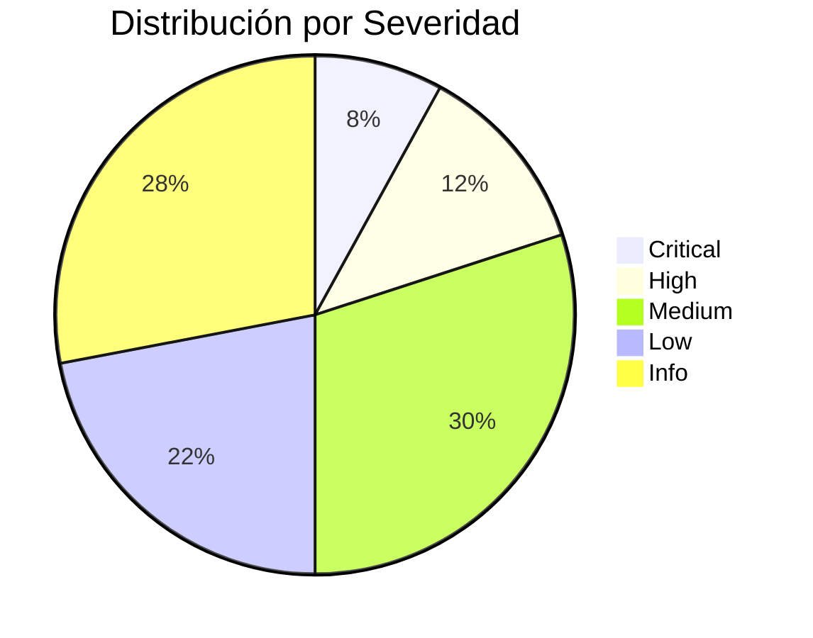
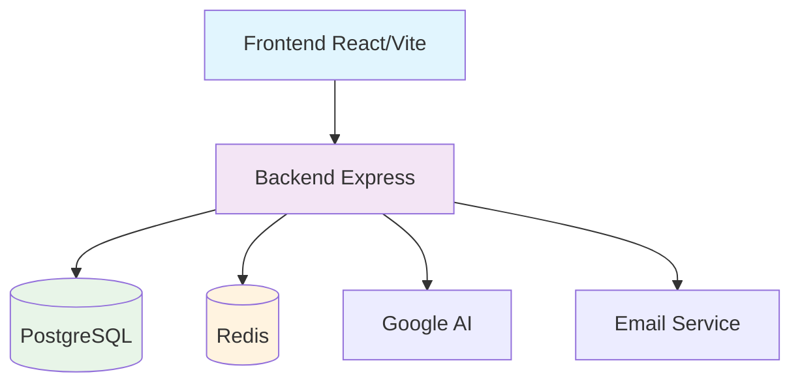

# 12 - Dashboard Ejecutivo

## 📊 Resumen Ejecutivo - Estado del Proyecto

**Fecha del Reporte:** Enero 2024
**Versión del Proyecto:** v1.0.0
**Estado General:** ⚠️ **REQUIERE ATENCIÓN**

---

## 🎯 Estado Actual

### ✅ Lo Bueno
- **Arquitectura Sólida:** Backend Node.js + Express bien estructurado
- **Funcionalidad Completa:** API RESTful completa, autenticación JWT
- **Frontend Moderno:** React + TypeScript + Vite
- **Base de Datos:** PostgreSQL con migraciones ordenadas
- **Entorno Local:** Funcionando correctamente

### ❌ Lo Que Necesita Atención
- **Seguridad Crítica:** 16 vulnerabilidades en dependencias
- **Testing Ausente:** Sin tests automatizados
- **Performance:** Sin métricas ni caché
- **Mantenibilidad:** Dependencias desactualizadas

---

## 📈 Métricas Clave

| Métrica | Valor Actual | Objetivo | Estado |
|---------|--------------|----------|--------|
| Vulnerabilidades | 16 críticas | 0 | 🔴 Crítico |
| Cobertura Tests | 0% | 70% | 🔴 Crítico |
| Tiempo Respuesta API | ~200ms | <100ms | 🟡 Medio |
| Health Checks | Básico | Avanzado | 🟡 Medio |
| ESLint Frontend | No configurado | Configurado | 🟡 Medio |

---

## 🔥 Top 5 Riesgos Críticos

### 1. 🔴 Vulnerabilidades de Seguridad
**Impacto:** Alto
**Probabilidad:** Alta
**Estado:** Pendiente
**Acción:** Actualizar dependencias inmediatamente

### 2. 🔴 Ausencia de Tests
**Impacto:** Alto
**Probabilidad:** Alta
**Estado:** Pendiente
**Acción:** Implementar framework de testing

### 3. 🟠 Rate Limiting Débil
**Impacto:** Medio
**Probabilidad:** Alta
**Estado:** Pendiente
**Acción:** Configurar límites por endpoint

### 4. 🟠 Sin Cobertura de Código
**Impacto:** Alto
**Probabilidad:** Media
**Estado:** Pendiente
**Acción:** Configurar medición de cobertura

### 5. 🟡 Sin Métricas de Performance
**Impacto:** Medio
**Probabilidad:** Media
**Estado:** Pendiente
**Acción:** Implementar Prometheus metrics

---

## 📊 Distribución de Hallazgos

---

## 🏗️ Arquitectura del Sistema

**Estado:** ✅ Funcional localmente

---

## 🚀 Roadmap de Remediación

### Semana 1: Seguridad Crítica
- [ ] Actualizar dependencias vulnerables
- [ ] Corregir rate limiting
- [ ] Remover secrets del repositorio

### Semana 2: Testing Foundation
- [ ] Configurar Vitest
- [ ] Tests de autenticación
- [ ] ESLint frontend

### Semana 3: Optimización de Datos
- [ ] Índices de base de datos
- [ ] Soft delete
- [ ] Constraints adicionales

### Semana 4: Observabilidad
- [ ] Métricas Prometheus
- [ ] Health checks avanzados
- [ ] Caché básico

### Semana 5-6: Mejoras Frontend
- [ ] Auditoría accesibilidad
- [ ] Optimización assets
- [ ] Tests de componentes

---

## 💰 Estimación de Esfuerzo

| Categoría | Horas Estimadas | Costo Estimado | Prioridad |
|-----------|-----------------|----------------|-----------|
| Seguridad | 20h | $2,000 | Crítica |
| Testing | 25h | $2,500 | Crítica |
| Performance | 15h | $1,500 | Alta |
| Frontend | 20h | $2,000 | Media |
| **Total** | **80h** | **$8,000** | - |

**Tasa por hora:** $100/h
**Duración:** 4-6 semanas

---

## 🎖️ Recomendaciones Ejecutivas

### ✅ Hacer Ahora (Esta Semana)
1. **Actualizar dependencias vulnerables** - Riesgo crítico de seguridad
2. **Implementar tests básicos** - Prevenir regresiones
3. **Configurar rate limiting** - Proteger contra ataques DoS

### 📋 Planificar (Próximas 2 Semanas)
4. **Configurar ESLint frontend** - Mejorar calidad código
5. **Añadir índices DB** - Mejorar performance
6. **Implementar métricas** - Observabilidad

### 🎯 Objetivos a 30 Días
- Vulnerabilidades: 0
- Tests básicos: Implementados
- Performance: Métricas activas
- Cobertura: >50%

---

## 📞 Próximos Pasos

### Inmediatos (24-48h)
1. **Revisar hallazgos críticos** con equipo técnico
2. **Aprobar plan de remediación**
3. **Asignar recursos** para Fase 1

### Semanales
- **Revisiones de progreso** cada viernes
- **Actualizaciones de métricas**
- **Ajustes al plan** según necesidades

### Mensuales
- **Auditoría de seguimiento**
- **Evaluación de riesgos residuales**
- **Planificación de mejoras futuras**

---

## 👥 Equipo Recomendado

| Rol | Responsabilidades | Habilidades Necesarias |
|-----|-------------------|------------------------|
| **Dev Principal** | Implementación core | Node.js, React, Testing |
| **QA Engineer** | Testing y calidad | Automation, E2E testing |
| **DevOps** | Infraestructura | Docker, CI/CD, Monitoring |
| **Security Lead** | Revisión seguridad | OWASP, Dependency scanning |

---

## 📋 Checklist de Go-Live

- [ ] Vulnerabilidades críticas: 0
- [ ] Tests automatizados: >50% cobertura
- [ ] Rate limiting: Configurado
- [ ] Health checks: Funcionales
- [ ] Métricas: Implementadas
- [ ] ESLint: Sin errores
- [ ] Documentación: Actualizada
- [ ] CI/CD: Configurado

---

## 🎯 Conclusión

El proyecto tiene una **base sólida** pero requiere **inversiones críticas en seguridad y testing** para ser production-ready. Con 4-6 semanas de trabajo enfocado, podemos lograr un producto seguro, mantenible y escalable.

**Puntuación General:** 6.5/10
**Estado de Riesgo:** Medio-Alto
**Recomendación:** Proceder con plan de remediación aprobado
